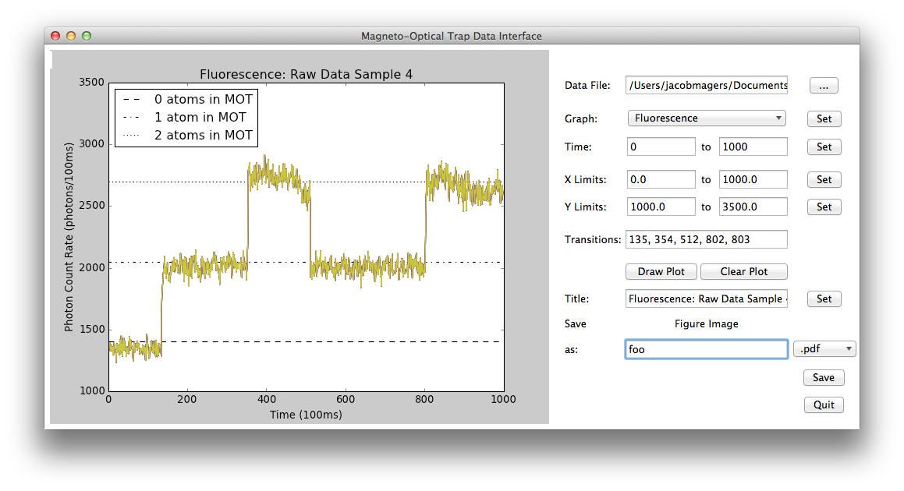

Magneto-Optical Trap Data Interface
========================

A graphical user interface for processing and visualizing data from a magneto-optical trap (MOT). Users see how many atoms are trapped at any given time as well as the power spectrum. They can edit and export the resulting figure as pdf, eps, or png. 

Motivation
--------------
Final project for PHYS 410/510: Principles of Scientific Programming at the University of Oregon. Requirements included large data sets and an interactive interface. We obtained data from a faculty member’s optics research lab.  

Features
--------
* Selects data file through dialog window
* Imports and processes data into bins for the two plots
* Does FFT for the Power Spectrum plot
* Detects changes in the number of trapped atoms and displays the times associated with those transitions^
* Dropdown menu selects which plot to display and changes scales accordingly
* Available plots: Fluorescence, Power Spectrum
* Takes user input for time window over which to plot the data, as well as <i>x</i> and <i>y</i> limits in the plot
* Allows user to set the title of the plot
* Saves figure (.pdf, .eps, .png) into working directory

^The transition detector occasionally displays a false positive, particularly when there are two or more atoms in the MOT. This is due to increased noise. Attempts at data smoothing produced more problems than they solved, e.g. missing transitions altogether. We leave it to the user to look at the fluorescence plot and make a judgement as to whether a given transition is real or not.  

Contents
------------
<code>motgui.py</code> contains all of the code for the interface. 

Four sample data files are included. Each is a 100 second run in the MOT and contains ~2 million data points. 

Usage
-----
    python motgui.py
    
Input data must be in a five-line header, three-column tab delimited format, e.g.

    ## Raw Data
    ## Last photon number received: 1979439
    ## Total packets received: 1979440
    # Data originally named "osc_test7_1154hz_bayes_osc_mag.0.105.1.raw"
    ## packet number	delay	running time
    0	2	2
    1	1396	1398
    2	8591	9989
    3	1602	11591
    4	11269	22860
    5	7103	29963
    6	9129	39092
    7	1395	40487
    8	16414	56901
    9	2173	59074
    10	19167	78241
    
The first column is a running count of photon count events. The second column is the time since the last count event in increments of 20ns. The third column is running time in increments of 20ns.

Dependencies: matplotlib, tkinter, numpy, csv, and math.

Snapshot
--------

Demonstration
------------
<iframe width='600' height='338' scrolling='no' frameborder='0' style='border: none;' src='https://www.wevideo.com/embed/#205889857'></iframe>
    
Contributors
------
* Jacob Magers 
* Daniel Mulkey
* Rebecka Tumblin

Thank you
------
* Dan Steck
* Richard Wagner
